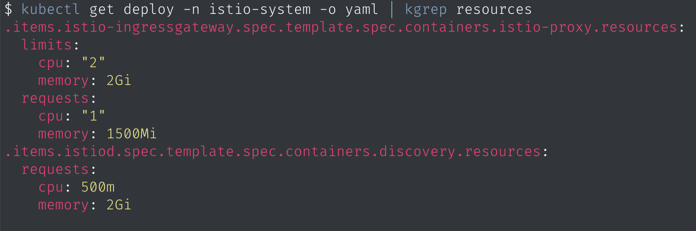

# kubectl-grep

Find the right peace in `kubectl get -o yaml` output. Pass substring of key to `kgrep` and it will find all matching keys.



## Examples

Show resource requests for all deployments in namespace

```sh
$ kubectl get deploy -n istio-system -o yaml | kgrep resources
.items.istio-ingressgateway.spec.template.spec.containers.istio-proxy.resources:
  limits:
    cpu: "2"
    memory: 2Gi
  requests:
    cpu: "1"
    memory: 1500Mi
.items.istiod.spec.template.spec.containers.discovery.resources:
  requests:
    cpu: 500m
    memory: 2Gi
```

Show podAffinity

```sh
$ kubectl get pod my-pod -o yaml | kgrep podAff
.spec.affinity.podAffinity:
  requiredDuringSchedulingIgnoredDuringExecution:
  - labelSelector:
      matchLabels:
        app: my-app
        release: my-app
    topologyKey: kubernetes.io/hostname
```

Show container images for pod

```sh
$ kubectl get pods my-app -o yaml | kgrep --exact image # or kgrep -e image
.spec.containers.my-app.image: my-company/my-app:1.0.0
.spec.containers.vault-agent.image: hashicorp/vault-agent:1.4.5
```

Show kernel version on nodes

```sh
$ kubectl get node -o yaml | kgrep --show-status ker  # or kgrep -s ker
.worker-0.status.nodeInfo.kernelVersion: 4.19.0-11-amd64
.worker-1.status.nodeInfo.kernelVersion: 4.19.0-11-amd64
.worker-2.status.nodeInfo.kernelVersion: 4.19.0-11-amd64
```

## Syntax highlighting

1. Install [bat](https://github.com/sharkdp/bat)
2. Configure kgrep to pass it's output into `bat` via environment variable `KUBECTL_GREP_PASS_OUTPUT`
   ```sh
   # ~/.profile
   export KUBECTL_GREP_PASS_OUTPUT="bat --language yaml --style plain --color always"
   ```

## Installation

Download latest release from releases page and but the binary in your PATH
